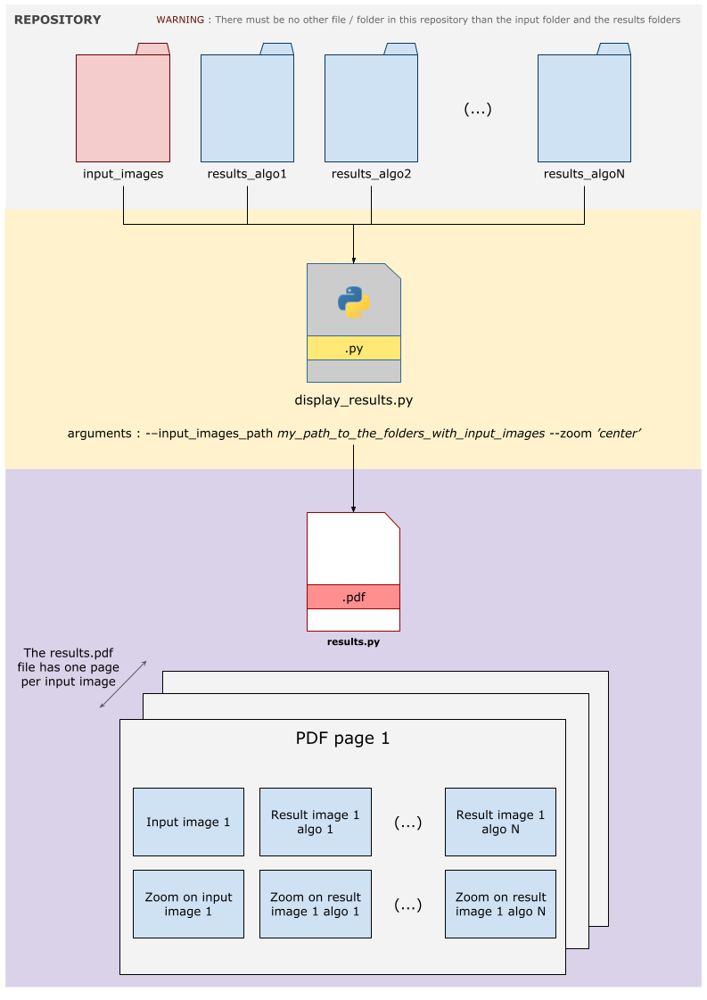
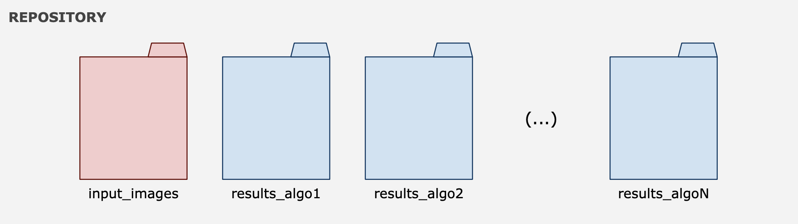

# Was is the display_tool 💡

This repository was created to help analysis the results of a benchmark between different algorithms dealing with images. Imagine you have 200
images in the folder `inputs/` and you want to compare the outputs that different models, let's say `algo1`, `algo2`... `algoN` give when ran on
all images of `inputs/`. If you store the outputs of the N algorithms in N folders, the **display_tool** will create some PDFs that contain on each
page one of the input images and the corresponding outputs of the different algorithmes.    

Along with the stripes created, made of the input and the outputs of each algorithm, you can get a zoom in each image to have more details. This is
done thanks the `--zoom *zooming_option* ` argument that is per default set to *center*. What means that it will plot just bellow each image a center
crop of the images.    

Here comes an illustration of the overall operating of **display_tool** :   

# How to use display_tool 📝

First of all you should get the input and outputs folders at the same location in the same folder, to have something like this :   

Then you can call the display_tool.py file from the command line :

`python display_tool.py --inputs_folder *path/to/folder/with/inputs* --output_pdf_path *where/you/want/the/pdf/written* --zoom *"center"* `   

<ins>Note</ins> : For the moment the only zoom option is center, but other options will soon be available.
